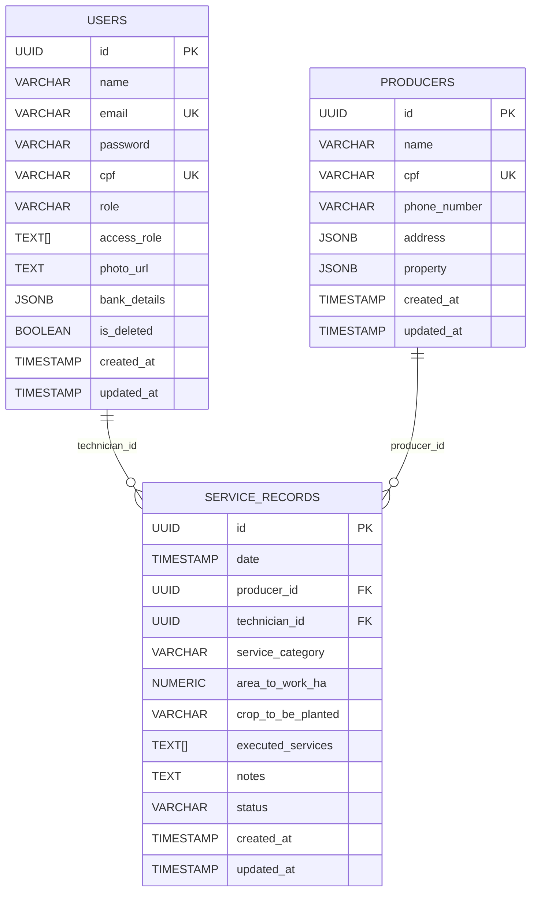

<!-- omit in toc -->
# Database Architecture - SIGA Project

This document outlines the relational database architecture for the SIGA (Integrated Agricultural Management System) API, using PostgreSQL. The design prioritizes standardization, scalability, and robustness, serving as the foundation for all system operations.

<!-- omit in toc -->
## Table Of Content

- [Overview](#overview)
- [Table Structures](#table-structures)
  - [users](#users)
  - [producers](#producers)
  - [service\_records](#service_records)
- [Relationships](#relationships)
- [Simplified Entity Relationship Diagram](#simplified-entity-relationship-diagram)

## Overview

The database consists of three main tables:

- **users**: Stores information about system users (e.g., technical and administrative staff).
- **producers**: Stores information about rural producers served by the system.
- **service_records**: Central table that logs each service interaction, linking users and producers.

## Table Structures

### users

Stores system user data.

| Column           | Type              | Constraints                        | Description                                      |
|------------------|-------------------|------------------------------------|--------------------------------------------------|
| id               | UUID              | PRIMARY KEY                        | Unique identifier (UUID, preferably generated by the application) |
| name             | VARCHAR(255)      | NOT NULL                           | Full name of the user                            |
| email            | VARCHAR(255)      | NOT NULL, UNIQUE                   | Unique login email                               |
| password         | VARCHAR(255)      | NOT NULL                           | Login password                                   |
| cpf              | VARCHAR(14)       | NOT NULL, UNIQUE                   | Unique CPF (Brazilian ID)                        |
| role             | VARCHAR(100)      |                                    | User role (e.g., "Technical", "Administrative")  |
| access_role      | TEXT[]            |                                    | User system access roles                         |
| photo_url        | TEXT              |                                    | URL to profile picture                           |
| bank_details     | JSONB             |                                    | Bank details as JSON: { "bank": "...", "agency": "...", "account": "..." } |
| is_active        | BOOLEAN           | NOT NULL, DEFAULT true             | Indicates if the user account is active          |
| created_at       | TIMESTAMP         | NOT NULL, DEFAULT NOW()            | Record creation timestamp                        |
| updated_at       | TIMESTAMP         | NOT NULL, DEFAULT NOW()            | Last update timestamp                            |

### producers

Stores rural producer data.

| Column           | Type              | Constraints                        | Description                                      |
|------------------|-------------------|------------------------------------|--------------------------------------------------|
| id               | UUID              | PRIMARY KEY                        | Unique identifier for the producer               |
| name             | VARCHAR(255)      | NOT NULL                           | Full name of the producer                        |
| cpf              | VARCHAR(14)       | NOT NULL, UNIQUE                   | Unique CPF                                       |
| phone_number     | VARCHAR(20)       |                                    | Contact phone number                             |
| address          | JSONB             |                                    | Address as JSON: { "street": "...", "number": "...", "community": "..." } |
| property         | JSONB             |                                    | Property data as JSON: { "name": "...", "totalAreaHa": ... } |
| created_at       | TIMESTAMP         | NOT NULL, DEFAULT NOW()            | Record creation timestamp                        |
| updated_at       | TIMESTAMP         | NOT NULL, DEFAULT NOW()            | Last update timestamp                            |

### service_records

Central table for service records, linking users and producers.

| Column             | Type              | Constraints                        | Description                                      |
|--------------------|-------------------|------------------------------------|--------------------------------------------------|
| id                 | UUID              | PRIMARY KEY                        | Unique identifier for the service record         |
| date               | TIMESTAMP         | NOT NULL                           | Date and time of the service                     |
| producer_id        | UUID              | NOT NULL, FOREIGN KEY              | References producers.id                          |
| technician_id      | UUID              | NOT NULL, FOREIGN KEY              | References users.id                              |
| service_category   | VARCHAR(255)      | NOT NULL                           | General service category (e.g., "Agricultural Mechanization") |
| area_to_work_ha    | NUMERIC(10,2)     |                                    | Area to be worked (in hectares)                  |
| crop_to_be_planted | VARCHAR(255)      |                                    | Crop to be planted                               |
| executed_services  | TEXT[]            |                                    | Array of executed services (e.g., {"plowing", "harrowing"}) |
| notes              | TEXT              |                                    | General notes or details                         |
| status             | VARCHAR(50)       | NOT NULL                           | Current status (e.g., "Pending", "Completed")    |
| created_at         | TIMESTAMP         | NOT NULL, DEFAULT NOW()            | Record creation timestamp                        |
| updated_at         | TIMESTAMP         | NOT NULL, DEFAULT NOW()            | Last update timestamp                            |

## Relationships

- **users ↔ service_records**: One-to-many. A user (technician) can have multiple service records, but each service record is linked to a single user via `service_records.technician_id → users.id`.
- **producers ↔ service_records**: One-to-many. A producer can have multiple service records, but each service record is linked to a single producer via `service_records.producer_id → producers.id`.

## Simplified Entity Relationship Diagram

